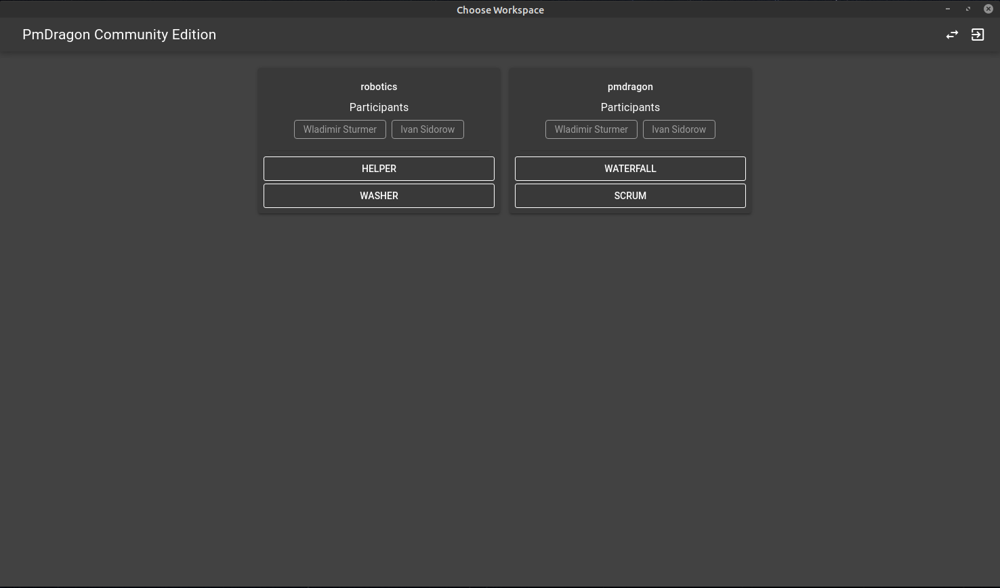
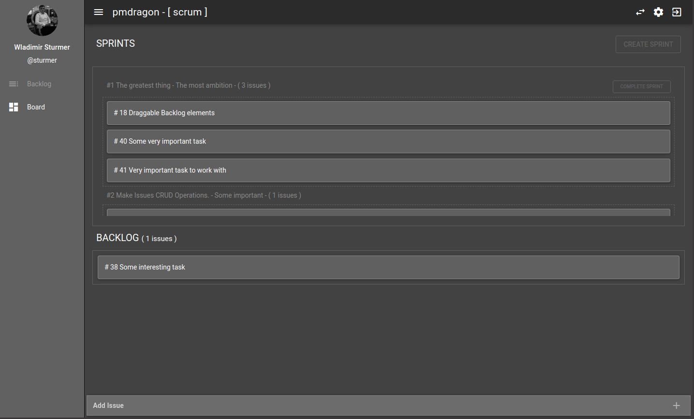
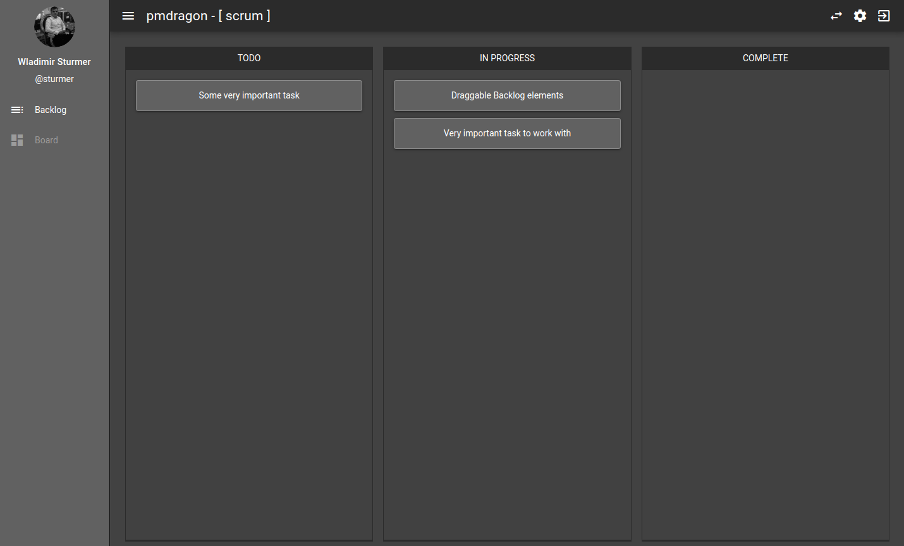
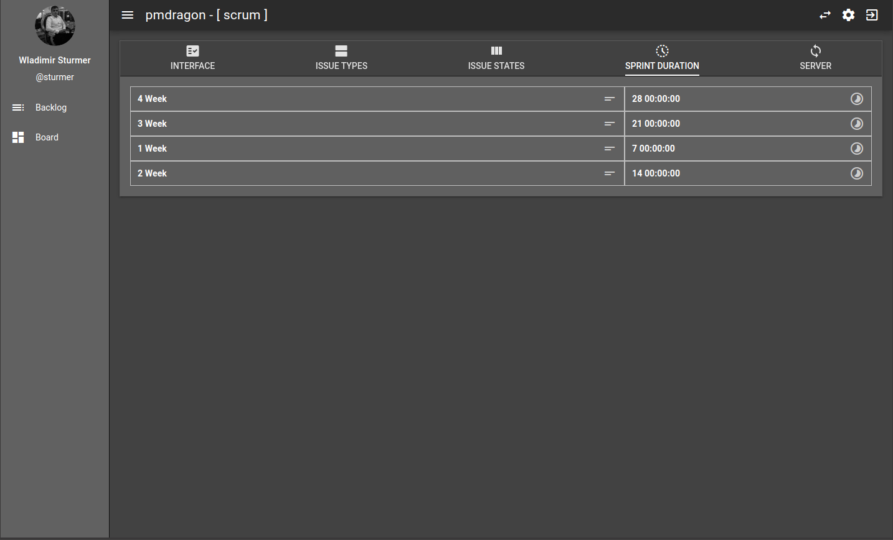

# PmDragon Community Edition

Open source project management tool to track tasks, epics, bugs and manage it with agile boards and sprints.

High-performance VueJs user interface built in MPA application.

## Screenshot demo
*Worspaces page*

*Backlog page*

*Board page*

*Settings page*

## Notice

Not ready for using.

Under development.

## Starting

In a directory of clone.

`docker-compose -f docker-compose.yml up -d`

## Stopping

In a directory of clone.

`docker-compose -f docker-compose.yml down`

## Documentation

Under development.

## Semver

PmDragon is following [Semantic Versioning 2.0](https://semver.org/)

## License

PmDragon is an MIT-licensed open source project.

Copyright ©2020-present Wladimir Stürmer

[MIT License](https://en.wikipedia.org/wiki/MIT_License)
